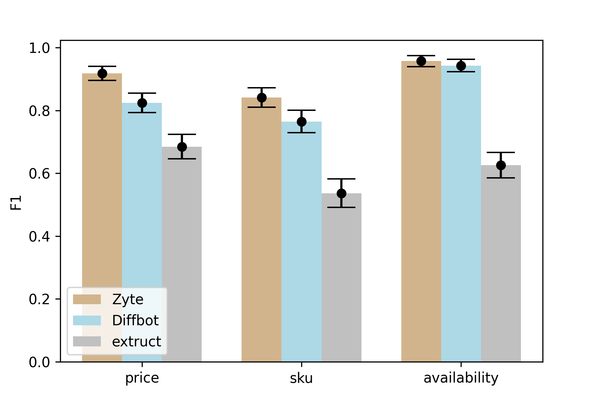

============================
Product extraction benchmark
============================

Overview
========

The goal of this evaluation is to compare the quality of product extraction
between Zyte Automatic Extraction (Zyte), Diffbot, and open-source tools (extruct).
We evaluated quality of the following attributes:

* price
* availability (whether the product is in-stock or out-of-stock)
* SKU

Based on our comparison we found extraction quality of Zyte Automatic Extraction
is significantly better compared to Diffbot for price and sku attributes,
whilst results for availability are comparable.

When developing the comparison methodology we came across a challenge
of many target web pages displaying different prices based on
the geographical location and other factors.
To ensure a fair comparison all systems must receive exactly the same data input,
so we served page snapshots instead of original target pages
to compare what each extraction tool returned.

We have released the dataset (including web archive files), ground truth annotations,
evaluation code and baseline open source extraction code.

Results
=======

The main results are displayed in the chart below.
We used the F1 metric  for each attribute, a measure combining the precision and recall of the model.
The higher the F1 score, the better quality of extraction, a perfect model has an F1 score of 1.
We also show standard deviation in black, which tells how reliable the F1 values are,
and how they might change in a different dataset.

Detailed results of the comparison are presented in the table below.
In addition to  F1 we present precision and recall values, with standard deviation given after the “±” sign.
Also shown is Support for each attribute,
which is the number of pages where an attribute should be present according to ground truth annotations.
We  also present the metrics for InStock and OutOfStock values of the product availability attribute.

We see that for both price and sku attributes,
precision and recall of Zyte Automatic Extraction is significantly higher compared to Diffbot.
We also see that the difference in recall is greater than the difference in precision -
this means that Diffbot falls short in finding the expected value,
although the quality of the value it finds is also lower.

The difference in availability is not significant
as the dataset is somewhat biased towards products that are in stock:
there are only 9 out-of-stock products, so availability score is dominated by products which are in-stock,
while out-of-stock score is uncertain.

+--------------+-------------+---------------+---------------+---------------+-----------+
| Attribute    | System      | F1            | Precision     | Recall        |   Support |
+==============+=============+===============+===============+===============+===========+
| price        | Zyte        | 0.918 ± 0.023 | 0.918 ± 0.024 | 0.918 ± 0.024 |       134 |
+              +-------------+---------------+---------------+---------------+-----------+
|              | Diffbot     | 0.824 ± 0.031 | 0.844 ± 0.032 | 0.806 ± 0.034 |       134 |
+              +-------------+---------------+---------------+---------------+-----------+
|              | extruct     | 0.685 ± 0.039 | 0.864 ± 0.036 | 0.567 ± 0.044 |       134 |
+--------------+-------------+---------------+---------------+---------------+-----------+
| sku          | Zyte        | 0.841 ± 0.031 | 0.860 ± 0.030 | 0.822 ± 0.033 |       135 |
+              +-------------+---------------+---------------+---------------+-----------+
|              | Diffbot     | 0.765 ± 0.035 | 0.828 ± 0.035 | 0.711 ± 0.039 |       135 |
+              +-------------+---------------+---------------+---------------+-----------+
|              | extruct     | 0.537 ± 0.045 | 0.786 ± 0.049 | 0.407 ± 0.043 |       135 |
+--------------+-------------+---------------+---------------+---------------+-----------+
| availability | Zyte        | 0.957 ± 0.018 | 0.957 ± 0.018 | 0.957 ± 0.018 |       140 |
+              +-------------+---------------+---------------+---------------+-----------+
|              | Diffbot     | 0.943 ± 0.020 | 0.943 ± 0.020 | 0.943 ± 0.020 |       140 |
+              +-------------+---------------+---------------+---------------+-----------+
|              | extruct     | 0.626 ± 0.041 | 0.905 ± 0.034 | 0.479 ± 0.043 |       140 |
+--------------+-------------+---------------+---------------+---------------+-----------+
| InStock      | Zyte        | 0.977 ± 0.010 | 0.970 ± 0.015 | 0.985 ± 0.010 |       131 |
+              +-------------+---------------+---------------+---------------+-----------+
|              | Diffbot     | 0.970 ± 0.011 | 0.956 ± 0.018 | 0.985 ± 0.011 |       131 |
+              +-------------+---------------+---------------+---------------+-----------+
|              | extruct     | 0.954 ± 0.014 | 0.954 ± 0.019 | 0.954 ± 0.018 |       131 |
+--------------+-------------+---------------+---------------+---------------+-----------+
| OutOfStock   | Zyte        | 0.625 ± 0.154 | 0.714 ± 0.184 | 0.556 ± 0.174 |         9 |
+              +-------------+---------------+---------------+---------------+-----------+
|              | Diffbot     | 0.429 ± 0.175 | 0.600 ± 0.254 | 0.333 ± 0.166 |         9 |
+              +-------------+---------------+---------------+---------------+-----------+
|              | extruct     | 0.333 ± 0.147 | 0.333 ± 0.168 | 0.333 ± 0.167 |         9 |
+--------------+-------------+---------------+---------------+---------------+-----------+

.. contents::

Dataset
=======

URL collection
--------------

URLs were collected in two stages:

- popular domains: two data extraction experts outside of the data science team
  gave the following popular product domains, from which 7 URLs per site were collected:

  - Amazon ( 4 URLs from each of the following regions US, UK, DE, IT, FR were collected)
  - Walmart
  - Target
  - HomeDepot
  - Ebay
  - Zara
  - John Lewis
  - H&M
  - Alibaba
  - Rakuten
  - Zalando
  - BestBuy
  - Canadian Tire
  - Ikea
  - Wayfair

- less popular domains: we consulted two site catalogs and sampled 50 sites from each catalog,
  collecting 2 positive URLs from each site

When selecting  the URLs for this experiment, our goal was to ensure variety:
we wanted products from the main page, plus o some more deeply hidden,
products with and without discounts, and having some out-of-stock products.

Serving snapshots
-----------------

Prices and availabilities on many web-sites vary depending on the visitor location, time of day and other factors,
so in order to ensure that all systems receive the same input, we captured the snapshots of the pages and served them using
`pywb <https://pywb.readthedocs.io/en/latest/index.html>`_.
The snapshots included both the main page, and all sub-resources required for rendering, such as images, JS, CSS, etc.
``pywb`` is a web archiving capture and replay framework for python, implementing the basic functionality of a “Wayback Machine”.

Some web-sites were still broken even when serving from a snapshot,
either because they tried to obtain fresh product details,
or due to rendering being different from what was seen in the browser. Such pages were excluded from the dataset.

Snapshots can be prepared with the following command,
assuming ``dataset-warc`` folder contains the WARC snapshots
(available as an archive from the releases section of the repo:
`dataset-warc.zip <https://github.com/scrapinghub/product-extraction-benchmark/releases/download/v1.0.0/dataset-warc.zip>`_)::

    docker run --rm -it \
      -e INIT_COLLECTION=product-extraction-benchmark \
      -v `pwd`/dataset-warc:/dataset-warc \
      -v `pwd`/pywb-data:/webarchive \
      webrecorder/pywb:2.5.0 \
      wb-manager add product-extraction-benchmark /dataset-warc/*.warc.gz

Then we can do extra configuration to remove the frame::

    docker run --rm -it \
      -v `pwd`/pywb-data:/webarchive \
      --entrypoint /bin/bash \
      webrecorder/pywb:2.5.0 \
      -c "echo 'framed_replay: false' > /webarchive/config.yaml && touch /webarchive/templates/banner.html"

And then serve the snapshots::

    docker run --rm -it -p 80:8080 \
      -v `pwd`/pywb-data:/webarchive \
      webrecorder/pywb:2.5.0 \
      wayback -a

You can use ``dataset/pywb-mapping.json`` to map between page ids and URLs served by ``pywb``.

Dataset
-------

Dataset is included in the repo in several forms:

* html files (gzip-compressed) are included directly in the repo under ``dataset/html``,
  file names corresponds to page ids used in ``dataset/ground-truth.json``
* screenshots of pages (before snapshot creation) are included as an archive in the releases section of the repo:
  `dataset-jpeg.zip <https://github.com/scrapinghub/product-extraction-benchmark/releases/download/v1.0.0/dataset-jpeg.zip>`_,
  file names corresponds to page ids used in ``dataset/ground-truth.json``
* snapshots in ``WARC`` format which can be served by ``pywb`` are included as an archive in the releases section of the repo:
  `dataset-warc.zip <https://github.com/scrapinghub/product-extraction-benchmark/releases/download/v1.0.0/dataset-warc.zip>`_,
  file names have the form ``<DATETIME>-<ID>.warc.gz``, where ``<ID>`` corresponds to page ids used in ``dataset/ground-truth.json``

Annotations are available under ``dataset/ground-truth.json``, which looks like this::

    {
        "0094967f37c647407d92b624202736e3272231cf61f8ccaeca0b19aeb631ab28": {
            ...
            "brand": [
                "365 by Whole Foods Market"
            ],
            "gtin": [
                "099482467999"
            ],
            "sku": [
                "B07FW264WL"
            ],
            "url": "https://www.amazon.com/dp/B07FW264WL"
        },
        "01efbb747904557e90dcb56d1f255a4034d5206c796539e2ce4d9dd68672c098": {
            ...

Each evaluated attribute can have multiple values in the ground truth - all values are considered correct.

Evaluation
==========

Evaluation is performed by ``evaluate.py`` script, which requires Python 3.6+ and ``tabulate`` dependency.

The main metric is F1. Each attribute can have multiple ground truth values, but at most one predicted value is allowed.
Predictions from all systems are available under ``dataset/output``. Here are some attribute-specific notes:

* price was matched as a Decimal number, and currency was not evaluated.
* ``availability`` can have one of two possible values: ``InStock`` and ``OutOfStock``.
  This is a required attribute - in case it's not clear that the product is out-of-stock, it's assumed to be in-stock.
  For systems which can have an empty value (Zyte, extruct), we filled empty values with ``InStock`` to match Diffbot.
* ``sku`` is a `Stock Keeping Unit <https://en.wikipedia.org/wiki/Stock_keeping_unit>`_ and is quite flexible: this can be any
  identifier which is used by the web-site to uniquely identify the product on the web-site.
  Based on this, we used the following guidelines:

  - Even if an SKU was explicitly spelled out on a web-site, but the system extracted a different SKU from another place
    (e.g. Diffbot often extracts an SKU from the URL), we considered it to be correct if it looked like a unique identifier.
  - If such an identifier was also a GTIN, it was also considered correct, as it’s globally unique.
  - If such an identifier was a part of the product name (like an MPN), then this was not considered a correct SKU,
    as it’s not guaranteed to be unique across the web-site
    (unless it would have been an MPN in a mono-brand shop, but there were no such cases).
  - If an extracted SKU had extra text in it (e.g. ``product code 123`` instead of ``123``),
    then this was considered not correct - while it would likely still serve as unique,
    it may happen that the prefix would not always be present or might be different.
  - Non-critical differences in SKU were allowed, e.g. ``123/123`` instead of ``123123``,
    or ``123`` instead of ``P123``, as long as it was clear it does not break uniqueness
    ('PU_106160/01’ vs '106160' was not allowed).

Evaluated systems
=================

The following systems were evaluated:

* `Zyte Automatic Extraction: Product API <https://docs.zyte.com/automatic-extraction/product.html>`_ (or Zyte in this document).
  Pages were fetched using 2021.2.0 version.
* `Diffbot Product API <https://docs.diffbot.com/docs/en/api-product>`_ (or "Diffbot" in this document).
  Pages were fetched in February 2021.
* `Baseline open-source extractor <https://github.com/scrapinghub/product-extraction-benchmark/blob/master/extractors/run_extruct.py>`_
  using `extruct <https://github.com/scrapinghub/extruct>`_
  and `price-parser <https://github.com/scrapinghub/price-parser>`_ (or "extruct" in this document).
  This extractor uses semantic markup, is meant as a base-line, and it's recall is far from perfect.
  If you would like to add other open-source extractors to the evaluation, please raise issues or send pull requests.

Note that we served the pages with pywb, so the domain was different (it was the same for all domains).
This means that **if some systems had custom per-domain extractors, they wouldn't be active,
so the extraction quality might have been worse due to this.**

Error analysis
==============

Price
-----

Diffbot: often extracts the price from any number close to the product, such as number of reviews, SKU, or other numbers.
Also we can see that recall suffers more than precision.

Zyte: many errors come from semantic markup getting a price which is different from what is shown on the page,
e.g. a price with discount is shown but semantic markup shows a regular price.
Some errors come from bad price parsing, e.g. "34.000" parsed as "34000".
In some cases the price in the main product is empty,
but the system is erroneously picking up a price from a related product,
while it should be producing an empty price instead.

Availability
------------

Diffbot: most common error is failure to detect that an item is OutOfStock.

Zyte: most common error is failure to detect that an item is OutOfStock.
In a few cases, incorrect OutOfStock prediction is made when some sizes are still InStock.

SKU
---

Diffbot: many missing SKUs. Sometimes picks up an MPN as an SKU. Is able to extract SKUs from URLs.
Also we can see that recall suffers more than precision.

Zyte: Sometimes picks up an MPN as an SKU. Unable to extract SKUs from URLs.

License
=======

License for the code in this repo and for the dataset is MIT.
